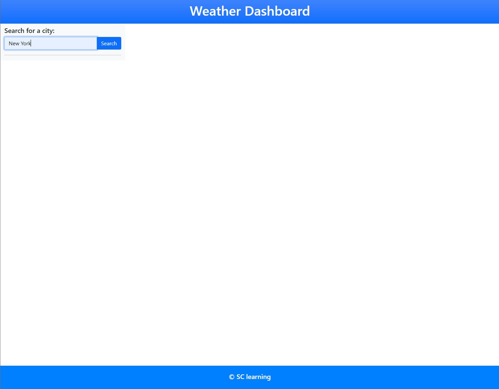
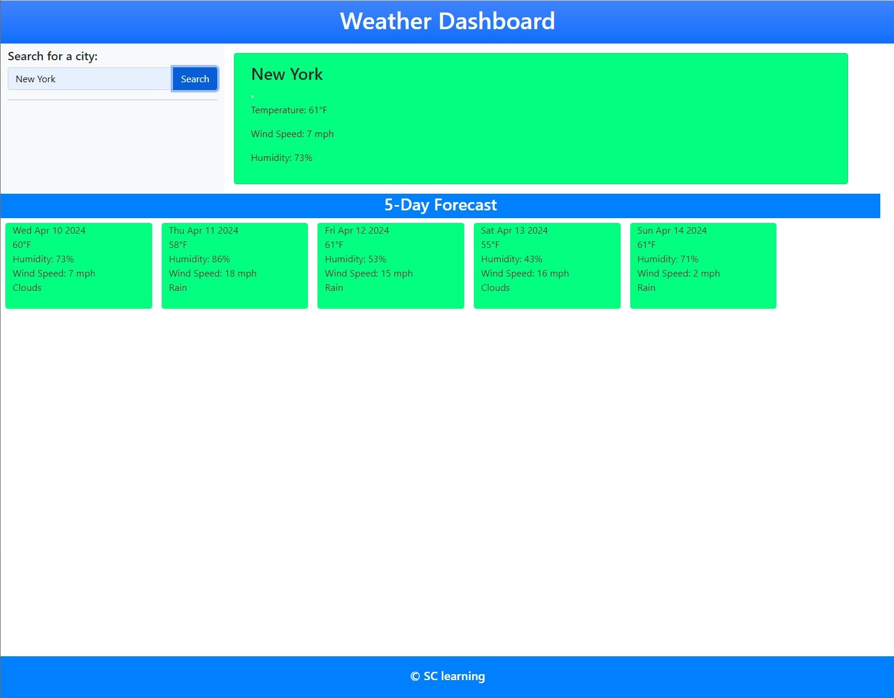

# Weather-Dash

## Description
The Weather Dashboard is a simple web application to review the weather. It utilizes the OpenWeatherMap API to fetch weather data for cities based on user input. The page searchs for weather by city name and displays todays weather forecast.  This page also displays the 5 day forecast for the same city.

## Code Highlights
* HTML
* CSS
* CSS3(Bootstrap 5)
* Javascript 
* Functions
* Objects
* Conditional Statements
* OpenWeatherMap API

## Demo
Demo App [https://sam-cowman.github.io/Weather-Dashboard/](https://sam-cowman.github.io/Weather-Dashboard/)

## Usage
1. Enter the name of a city in the search input field.
2. Click the "Search" button or press Enter.
3. View the current weather and 5-day forecast for the selected city.
4. Click on a city in the search history list to view its weather again.

## License
No License 